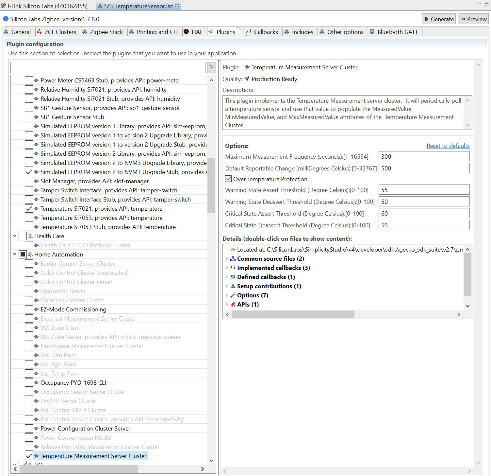
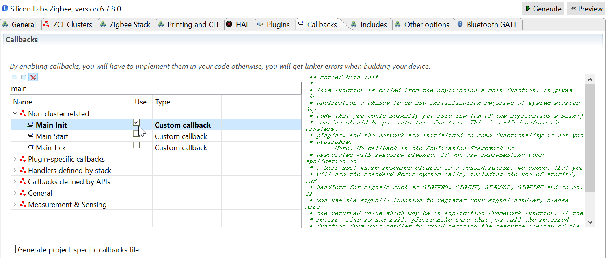
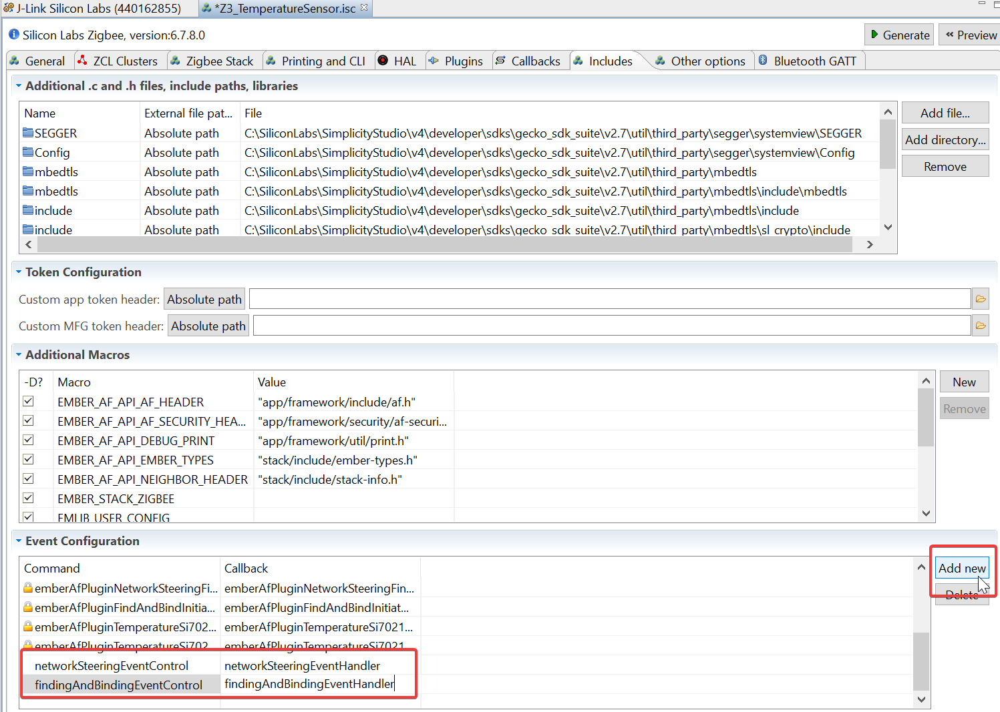

# Implement your application
Silicon Labs App Builder projects have a very specific way of being implmented:
* Plugins are provided, and bring sources in the project that cover basic implementations for you
* Stack and Plugins both define *Callback functions* that allow you to implement event driven algorithms

Be careful:
* A lot of code is generated or linked according to your ZCL and Plugin configurations
* Callback stub function definitions are handled by Appbuilder - letting you responsible of implementing the functions you selected

Consequently, your Appbuilder based application implementation is going to be split into 2 main parts, the Plugins & Callbacks implementation, and your own code.


## Appbuilder Based Implementation
#### Plugins to add
Through the *"Plugin"* tab, add thefollowing plugins (use the search bar to find it):
* Network Steering
    Used to join networks

* Update TC Link Key
    Used to join Zigbee 3.0 centralized networks

* Reporting
    Used to send periodic attribute reports
    Note that accuracy of reporting is relying on the LF clock source used (LFRCO, PLFRCO, LFXO)

* I2C Driver
    Used to implement I2C for Si7021 communication

* Temperature Si7021
    Driver implementation for the Si7021 (present on Thunder Board Sense boards)

* Temperature Measurement Server Cluster
    Implementation of ZCL Temperature Measurement Server Cluster 
    This allows you to simply edit the plugin options and not waste time implementing any of it

* Zigbee PRO Leaf Library 
    Lightened Zigbee PRO Library for End Devices use only

* Find and Bind Initiator
    Used to bind our device to a dicoverable Temperature Measurement Client 
    Mandatory as reportings only work using bindings - per spec

* Heartbeat
    Blinks an LED to display stack status (only applicable when deep sleep is disabled)



#### Callbacks to add
Through the *"Callbacks"* tab, add the following functions (use the search bar to find it):
* Main Init
    Will be used to add extra init code
* Complete (Network Steering)
* Hal button ISR



#### Custom Software Events
Finally, to safely link hardware events (i.e. button presses) to network or application actions (i.e. network joining, force sending reports) we need to declare Events in the ISC
This is done through the *"Includes"* tab of the ISC file, in the last section named *"Event Configuration"*

There add 2 new events:
* networkSteeringEventControl | networkSteeringEventHandler
* findingAndBindingEventControl | findingAndBindingEventHandler



All of the previous applies only when you click the "Generate" button on top of the ISC file


## Coded Implementation
Now that our project has its Plugins added, we will need to implement callback functions as well as events
By default, all callback implementations go to *project_name*_callbacks.c file
We will work there in this example

#### Callback implementations

-   Add the following lines at the top of the file:
```c
#include EMBER_AF_API_NETWORK_STEERING
#include EMBER_AF_API_FIND_AND_BIND_INITIATOR

#include "em_gpio.h"

#define TEMPERATURE_MEASUREMENT_ENDPOINT (1)

EmberEventControl networkSteeringEventControl;
EmberEventControl findingAndBindingEventControl;

void networkSteeringEventHandler(void);
void findingAndBindingEventHandler(void);
```

- Edit the emberAfMainInitCallback implementation so that it looks like this:
```c
void emberAfMainInitCallback(void) {
    GPIO_PinModeSet(BSP_I2CSENSOR_ENABLE_PORT, BSP_I2CSENSOR_ENABLE_PIN, gpioModePushPull, 1);
}
```

- Edit the networkManagementEventHandler as follows:
```c
void networkManagementEventHandler(void) {
     emberEventControlSetInactive(networkManagementEventControl);
     if (emberAfNetworkState() != EMBER_JOINED_NETWORK) {
        EmberStatus status = emberAfPluginNetworkCreatorStart(false);
        emberAfCorePrintln("%p network %p: 0x%X", "Form", "start", status);
     }
}   
```

-	Also, edit the network creator complete callback to have a feedback:

```c
void emberAfPluginNetworkCreatorCompleteCallback(const EmberNetworkParameters *network,
                                                 bool usedSecondaryChannels) {
    emberAfCorePrintln("%p network %p: 0x%X",
                       "Form distributed",
                       "complete",
                       EMBER_SUCCESS);
}
```

We have implemented the network formation part upon reset, now we will program its opening to other devices for joining.
-	Edit the networkOpeningEventHandler as follows :

```c
void networkOpeningEventHandler(void) {
    emberEventControlSetInactive(networkOpeningEventControl);
    if (emberAfNetworkState() == EMBER_JOINED_NETWORK) {
        emberAfPermitJoin(45,false);
        emberAfPluginFindAndBindTargetStart(WINDOW_COVERING_ENDPOINT);
    }
}
```

-	Edit the emberAfHalButtonIsrCallback as follows:

```c
void emberAfHalButtonIsrCallback(int8u button, int8u state) {
    if (state == BUTTON_RELEASED) {
        emberEventControlSetActive(networkOpeningEventControl);
    }
}
```

-	Finally, we will output the ZCL commands received by a remote :

```c
/** @brief Window Covering Cluster Window Covering Down Close
 *
 *
 *
 */
boolean emberAfWindowCoveringClusterWindowCoveringDownCloseCallback(void) {
    emberAfCorePrintln("Down Close received");
    return false;
}

/** @brief Window Covering Cluster Window Covering Up Open
 *
 *
 *
 */
boolean emberAfWindowCoveringClusterWindowCoveringUpOpenCallback(void) {
    emberAfCorePrintln("Up Open received");
    return false;
}

/** @brief Window Covering Cluster Window Covering Stop
 *
 *
 *
 */
boolean emberAfWindowCoveringClusterWindowCoveringStopCallback(void) {
    emberAfCorePrintln("Stop received");
    return false;
}
```

-	Build and flash the generated binary. Open a terminal on your kit.
-	Not working? Generate a bootloader project
-	Unreadable output? Retarget Vcom to enable through hardware configurator
-	Now, flash the remote-control binary on a second kit, and open a terminal.
-	Call the following CLI commands on it:

```console
zcl window up
```

or

```console
zcl window down
```

or

```console
zcl window stop
```

then

```console
bsend 1
```

And look at the output on the motor side

```
---
sort: 2
---
```

- 	Add some code mentioning its language

```c
#include EMBER_AF_API_NETWORK_CREATOR
#include EMBER_AF_API_NETWORK_CREATOR_SECURITY
#include EMBER_AF_API_FIND_AND_BIND_TARGET

#define WINDOW_COVERING_ENDPOINT (1)
EmberEventControl networkManagementEventControl;
EmberEventControl networkOpeningEventControl;

void networkManagementEventHandler(void);
void networkOpeningEventHandler(void);
```

-	Add some console steps

```console
zcl window up
```
