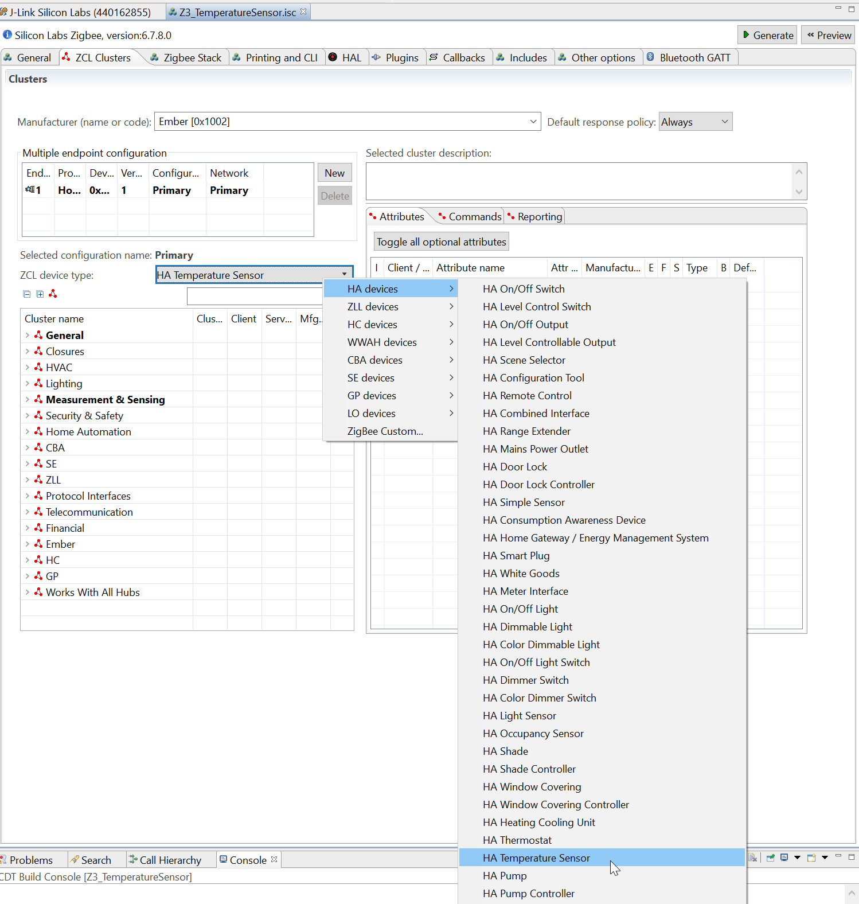

# Create and Configure the new project

## Create the project
-   Create a new Zigbee SoC project based on a *ZigbeeMinimal* project

-   Rename your project to *Z3_TemperatureSensor*

-   Select the target and desired toolchain (Thunderboard Sense 2 + GCC here)

## Configure the project
#### Hardware
-   Open the .ISC and go to the HAL tab and click *"Open Hardware Configurator"*
Alternatively open the .hwconf file located at the root of your project

-   Go to *"DefaultMode Peripherals"* and enable the *"I2C Sensor"*
Change its properties as follows:
* Sensor enable pin : PF9
* I2C peripheral : I2C 1

-   Still in *"DefaultMode Peripherals"*, change the I2C1 Settings as follows:
* I2C SCL : PC5
* I2C SCL : PC4

#### Application 

-   In the ISC configuration, in the *"ZCL dusters"* tab, change *"ZCL device type"* field of the *Endpoint 1* device to *"HA Temperature Sensor"*

-   In the ISC configuration, in the *"Zigbee Stack"* tab, change *"Zigbee Device Type"* field of the *ZigBee PRO network configuration* *"Sleepy End Device"*

-   Finally, still in the ISC configuration file, enable *"Printing and CLI"* options according to your needs

Note that these options are dynamically available depending on your Plugin and ZCL configurations
You might go back here at the end of your full project editions to see if you did not miss anything
